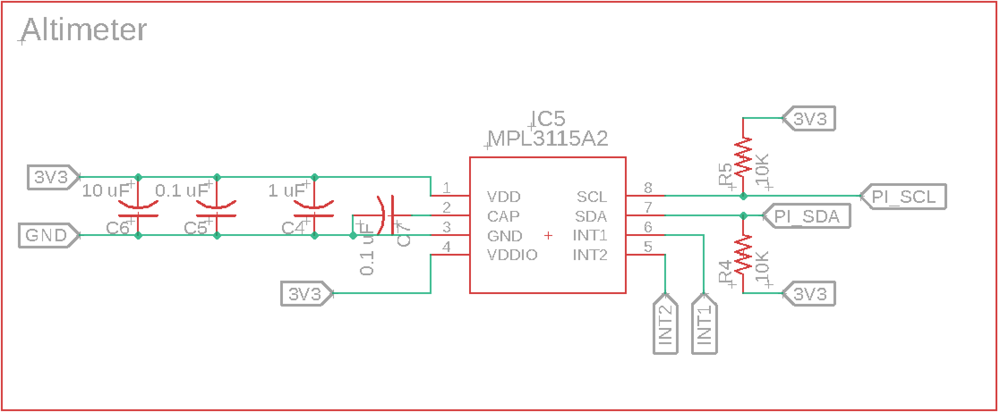
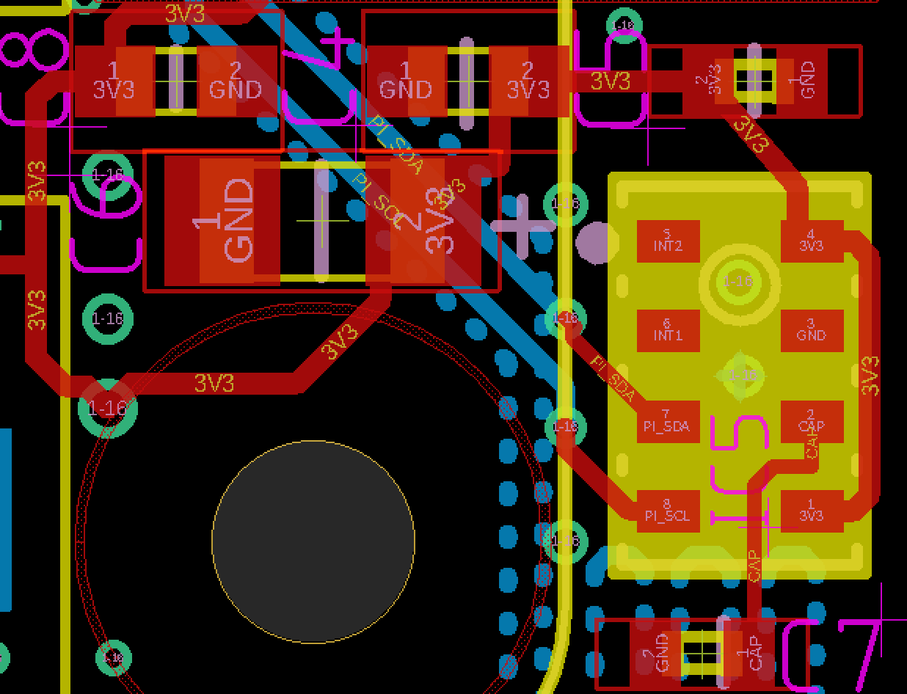

# EDS-Eagle-Library
_Eagle footprints of electronic components used in EDS projects._

When working on pcb design projects, one might encounter all kinds of components. Some manufacturers make Eagle files available for use; others don't. When you wish to incorporate a part that doesn't have readily available Eagle files available you'll have to create your own Eagle footprint.

## What is all this?

In short, when you use a component in Eagle it consists of a *symbol* and a *package*. The symbol is the symbolic representation as used in a circuit diagram. The package is the physical shape and layout on the PCB of that component.

To Illustrate, this is the *symbolic* circuit diagram of the MPL3115A2 Altimeter as used in Capra:

Whereas this is the same altimeter shown  as a package on the PCB layout (note that the two pull up resistors R4 & R5 are not shown in this image):

Without changing the circuit diagram, the PCB layout could be changed. For example, there are many other ways the traces could be routed for this circuit. Or, instead of using a 0402 size capacitor for C5, a different size could be chosen. This doesn't change the *circuit* only its *physical design*.

In order to make collaboration possible, all people who use an Eagle design file must have access to the same Eagle components. That's why it's advisable to use this collaborative Eagle library and push any new components to this repo. It'll save you time because you won't have to create packages from scratch and it will make collaboration easier, as it will allow others in the studio to build on the designs you create.

## How do I proceed?

An elaborate guide on how to create custom components in Eagle can be found here: <https://www.autodesk.com/products/eagle/blog/library-basics-part-1-creating-first-package-autodesk-eagle/>
